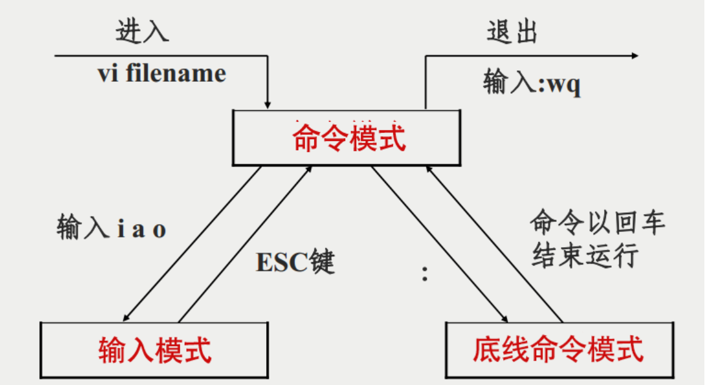

# Linux

## 基础命令

### ls  查看

- -l	文件详情
- -h   显示文件大小
- -r   查询结果列表翻转
- -S   按文件大小进行排列
- -a   全部（包括隐藏文件）

### cd  进入

- cd        相对路径 **或** 绝对路径
- cd ..     返回上级目录
- cd /      返回根目录
- cd ~     返回当前用户的家目录

### cp  复制

- cp [选项 ]  [路径/]file1  [路径/]file2   (**file2与file1不同**则  **相当于复制并改名**)

- -r 递归目录全部内容，子目录/子目录...都拷贝
- -d 复制时保留链接
- -p 复制源文件内容后，将修改时间和访问权限也都复制过去
- -a 相当于以上三个全加  -rpd
- -i  交互式复制（提示需不需要覆盖）
- -l  不做拷贝，只是创建一个链接

### mv  移动/重命名

- -i  同名时询问是否覆盖
- -f  不显示任何提示，默认覆盖

| 命名格式         | 运行结果                                 |
| ---------------- | ---------------------------------------- |
| mv 文件名 文件名 | 将源文件名改为目标文件名                 |
| mv 文件名 目录名 | 将源文件移动到目标目录                   |
| mv 目录名 目录名 | 目标目录存在，这移动至目标目录，否则改名 |
| mv 目录名 文件名 | 出错                                     |

### cat 读取并写入文件

- cat [选项] file1 [>file2]
- -n 从 1 开始，对所有行加个行号
- -b 与-n相同，空行不加
- -s  两行及以上空行，保留一行空行

| 语法                             | 作用                                       |
| -------------------------------- | ------------------------------------------ |
| cat > file                       | 从键盘读取数据，创建新文件或者替换已有文件 |
| cat >> file                      | 从键盘读取数据，将数据追加到已有文件中     |
| cat < file                       | 显示一个已有文件                           |
| cat file                         | 显示一个已有文件                           |
| cat < file1 >file2               | 复制文件                                   |
| cat file1 file2 file3 \| less    | 组合多个文件，每次一屏的显示结果           |
| cat file1 file2 file3 > file4    | 组合多个文件，将输出保存到一个不同的文件中 |
| cat file1 file2 file3 \| program | 组合多个文件，将输出管道传送给另一个程     |

### mkdir 创建目录

- mkdir [选项] dir1 [dir2] [dir3] [...]
- mkdir -p dir1/dir2/dir3

## vi/vim 编辑器

### 命令模式

- 刚启动 vi/vim，进入命令模式
- i   切换到输入模式，以输入字符
- x  删除当前光标所在处的字符
- ：切换到底线命令模式

### 输入模式

- Esc，退出到命令模式

### 底线命令模式

- ：q  退出
- ：q！强制退出
- ：wq 保存并退出
- ：wq！保存并强制退出

